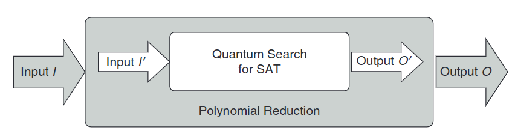
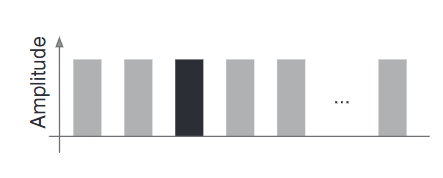
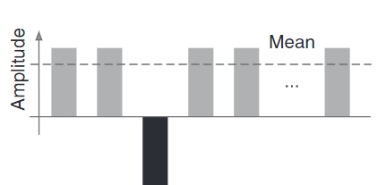
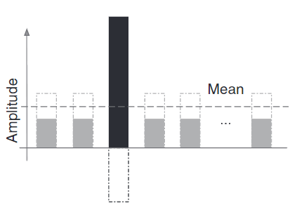
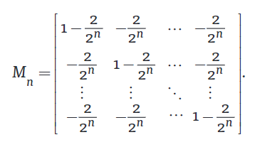
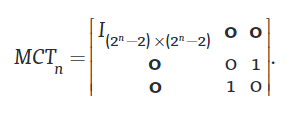

# Reduction-Based_Problem_Mapping_for_Quantum_Computing

An end-to-end framework for mapping computationally hard problems on a quantum computer via reduction.

Quantum computing is not experiencing the same growth as Quantum Computers because it is hard to understand how quantum computation system works and how to design effective algorithms, unlike in the classical case.

The paper suggests a framework with exploitation of reduction as its key feature.

> Toward  this  goal,  we  propose  an  end-to-end  framework  for  mapping  computationally hard problems on a gen-eral circuit-model quantum computer via reduction. 

By using a core quantum solver designed to solve a single problem, many other problems may be benefited from the quantum speed-up, by using a reduction wrapper around the core quantum solver.

**Finding one solution potentially gives us immediate quantum accelerators for all**

## 🏗️ Implementing Quantum Softwares is Hard

The widely believed statement (by software engineers and quantum physicists), that programming quantum computers/software is hard is evidenced by the following assertions:

1. Fair amount of knowledge on quantum computing as a pre-requisite.
   
2. No clear idea how to implement classical data structures like array, linked-list, graphs, etc on a quantum computer.

Even a limited set of quantum algorithms have been developed in the past half-century due to the fact that quantum computers behave very differently from classical machines.

> our techniques for designing algorithms and  our  intuitions  for  understanding  the  process  of  computation  no  longer  work - Peter Shor

## 📥 Reduction-based Quantum Pipeline

The following property is used to achieve quantum computing pipeline that will enable people with limited quantum computing backgrounds to tap into the power of quantum computers:

**NP-Complete problems can be reduced to each other in polynomial time**

This implies that if we can program a quantum computer to solve one particular problem, then we can apply that to speed up other problems.



### ✍🏽 Outline

1. Implement a quantum algorithm that directly solves some particular problem S
2. Transform the general input I to I' via polynomial time reduction
3. Feed the input I' to S and get the output O'
4. O' is converted back to the desired output O for the original input I

We will be choosing the unrestricted Boolean-SAT as the problem S, which can be solved with the help of Quantum Search(Grovers Algorithm).

Briefly speaking, Any input problem is transformed via reduction  to  a  SAT  instance,  for  which  we  use  quantum  search to find a solution that can then be  transformed  back  for  the  original  input according to the reduction.

## 🔍 Quantum Search (Grovers Algorithm)

### 📦 Setup

1. Unordered collection of N items
2. Binary oracle function *f*. If *f(i)* == -1, that means we have a hit, else if *f(i)* == 0, then we need to keep on searching.

In classical computing, on average we need N/2 queries to the oracle function *f*, since we can only check on a single item at a time.

But on a quantum computer, we can take advantage of superposition and then do a single check on all N items at the same time.

```
n = log2(N)
```

So n qubits are put into superposition.

### 🎰 Superposition of the Qubits

Start by putting all the qubits into uniform superposition by using a Hadamard Gate. This makes sure all the qubits have the same amplitude, including the target.



The dark bar is for the target qubit.

### 📊 Evaluating the Oracle Function

The oracle is then evaluated on the uniform superposition state. This flips the amplitude of the target qubit, while rest are untouched.



### 🪆 Applying the Diffusion Operator

After applying the diffusion operator, the amplitude of the target qubit gets amplified, while the rest is reduced. Basically we are taking a reflection-about-the-mean.

The Grovers Diffusion Operator basically amplifies the amplitude of the marked target state.



The diffusion operator is the corresponding unitary matrix Mn:




We should apply the Oracle Function-Diffusion Operator step approx. square root of N times.


## 🔍 Quantum Search Circuit for SAT

We can use Quantum Search to find satisfying variable assignments.

### Determining the Oracle Function

We can use the the logic expression as the oracle function *f* itself. Where each of the 2^n possible states corresponds to a particular assignment to the n-boolean variables

We then need to be able to represent boolen logic using a quantum computer.

NOT-Gate can be realised using a Pauli-X Gate
AND-Gate can be realised using a 3 Qubit Toffoli Gate
OR-Gate can be realised using a NOT and AND Gate

Multiple-Control Toffoli gate (MCT) can be used to AND together mulitiple variables.  



### Determining the Diffusion Operator


*refer the paper for more info about the above formula*